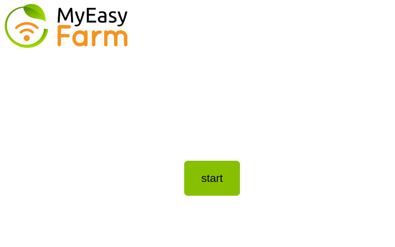
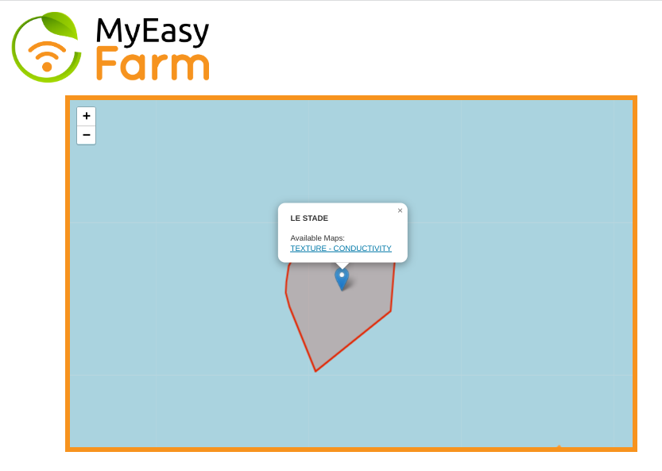
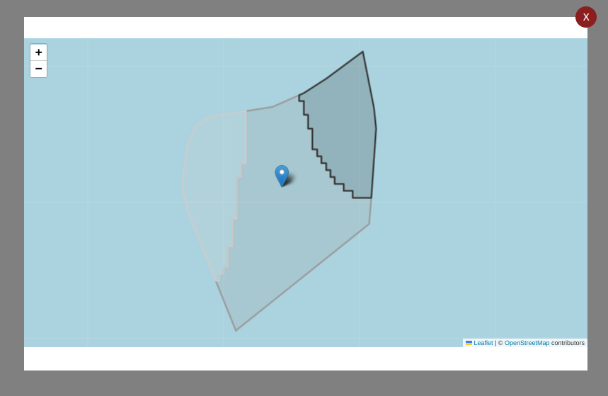

#  MyEasy Farm Test 

This project is about making a small map web application with the following requirements:
- An app should have a welcome screen with a start button at the very center of the page;
- After clicking on the start you should be presented with the map, where fields (from partfield.json) are displayed;
- You should be able to click on the field and see a list of available maps for this field;
- You should be able to click on a map to preview it;
- During preview app should focus (zoom/center) on the map you are previewing;
- You should be able to exit the preview screen by clicking on the close button;
- Maps should either use predefined colors or be colorized based on the value;
- On the top left corner the logo should always be visible.

 ## Input:
- 2 files with responses from the server (a subset of fields and a subset of soil maps);
- logo and colors guidance;
- UX sketch;
- reference screenshots from the real app, showing some of the maps and fields.

## Built With

- React
- Typescript
- React-Leaflet
  
## Live Demo

[Live Demo Link](https://mef-app.herokuapp.com/map)

## Getting Started

To get a local copy up and running follow these simple example steps.

1  `
git clone https://github.com/azy64/myeasy-farm.git
`
 
2  `
yarn 
`
 
3  `
yarn start
`
 
Runs the app in the development mode.\
Open [http://localhost:3000](http://localhost:3000) to view it in your browser.
### Prerequisites

### `yarn build`

Builds the app for production to the `build` folder.\
It correctly bundles React in production mode and optimizes the build for the best performance.

The build is minified and the filenames include the hashes.\
Your app is ready to be deployed!

See the section about [deployment](https://facebook.github.io/create-react-app/docs/deployment) for more information.

## Authors

👤 **Author**

- GitHub: [@Azy64](https://github.com/azy64)
- LinkedIn: [LinkedIn](https://www.linkedin.com/in/azaria-saidi-524780112/)

## 🤝 Contributing

Contributions, issues, and feature requests are welcome!

Feel free to check the [issues page](../../issues/).

## Show your support

Give a ⭐️ if you like this project!

## Acknowledgments

- Hat tip to anyone whose code was used
- Inspiration
- etc

## 📝 License

This project is [MIT](./MIT.md) licensed.